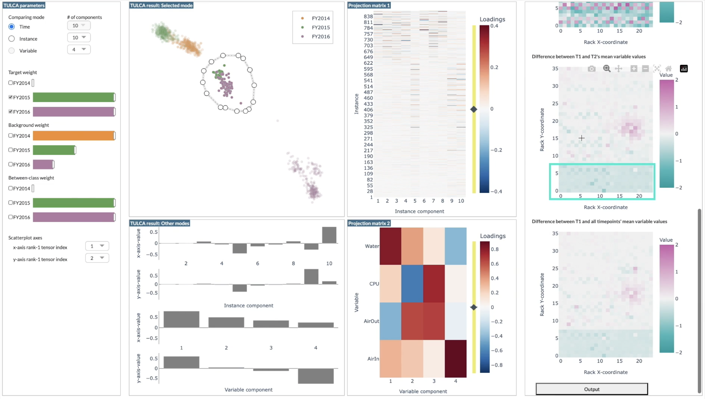

## Visual Analytics Using Tensor Unified Linear Comparative Analysis

About
-----
* TULCA and visual UI that can be directly used from Python and the Jupyter Notebook from: ***Visual Analytics Using Tensor Unified Linear Comparative Analysis***.
Naoki Okami, Kazuki Miyake, Naohisa Sakamoto, Jorji Nonaka, and Takanori Fujiwara.
IEEE Transactions on Visualization and Computer Graphics(also, Proc. IEEE VIS 2025), forthcoming.
[arXiv Preprint](https://doi.org/10.48550/arXiv.2507.19988)

* Demonstration video: [YouTube Link](https://www.youtube.com/watch?v=qH66WYiLUhE)

  

* Features
  * New tensor decomposition method, TULCA (tensor unified linear comparative analysis). TULCA is an extension of ULCA[1], which unifies and enhances linear discriminant analysis and contrastive PCA (Abid and Zhang et al., 2018).
    * [1] Takanori Fujiwara, Xinhai Wei, Jian Zhao, and Kwan-Liu Ma, "[Interactive Dimensionality Reduction for Comparative Analysis](https://doi.org/10.1109/TVCG.2021.3114807)." IEEE Transactions on Visualization and Computer Graphics, vol. 28, no. 1, pp. 758-768, 2022 (also, Proc. IEEE VIS 2021).
  * Prototype interactive visual interface using TULCA.

******

Content
-----
* tulca: Manifold-optimization-based and eigenvalue-decomposition-based TULCA.
* ui: Prototype interactive visual interface using TULCA (implemented with Dash).
* experiment: Experiment using synthetic multivariate time-series data (see Sec. 5 of the TULCA paper).
* perf_eval: Performance evaluation of TULCA (see Sec. 7).
* data: Data utilized in the TULCA paper (excluding the K log dataset, which cannot be made publicly available).

******

TULCA Setup and Usage
-----

### Requirements
* All major OSs are supported (macOS, Linux, Windows)

* Python3 (latest)

* Note: Tested on macOS Sequoia, Ubuntu 24.04 LTS, Google Colab, and Windows 10.

### Setup

* Install with pip:

    `pip3 install tulca`

### Usage
* See sample.py. 
  * sample.py can be run with `python3 sample.py` (need pandas, scikit-learn, matplotlib: install with `pip3 install pandas scikit-learn matplotlib`)

* Documentation can be found in `tulca/tulca.py`. It follows the standard python documentation format and can be accessed from `help()` function. For example, after import tulca (`from tulca import TULCA`)

  - To show the entire documentation of TULCA class: `print(help(TULCA))`

  - To show a specific method's documetation of TULCA class: `print(help(TULCA.fit))`

******

Interactive Visual Interface Setup and Usage
-----

### Requirements
* Python3 (latest)
* Note: Tested on macOS Sequoia

### Setup (tulca)

* Install with pip3. Move to the directory of `ui`. Then,

    `pip3 install -r requirements.txt`

* (Optional) To have a precise layout used in the TULCA paper, need to adjust a CSS style embedded in the Dash library as follows.

  * Find `padding:"25px"` from the installed dash's `dcc/async-slider.js` (e.g., `.venv/lib/python3.13/site-packages/dash/dcc/async-slider.js`) and replace with `padding:"0px"`.

### Usage

#### Usage from a web browser 
* Move to the directory of `ui` and run main.py. 

  `python3 sample.py`

* Then, open browser and input the URL shown in the terminal (e.g., http://127.0.0.1:8050)

* Note: By default, sample.py uses the highschool communication dataset. But, the dataset can be changed to mhealth by changing `analysis_case = "highschool_inst"` to `analysis_case = "mhealth"` Or, to use this UI for your own dataset, you can prepare a dataset and identify its file path .

#### Interactive analysis example using Jupyter Notebook
* See an example provided in `notebook_example.ipynb`

******

Experiment Using a Synthetic Dataset and Performance Evaluation
-----
* The corresponding files can be run through:

  * Experiment: Move to `experiment` and then `python3 test_with_synthetic_data.py`

  * Performance evaluation: Move to `perf_eval` and then `python3 perf_eval.py` and `python3 perf_eval_mhealth_synthetic.py`

******

Datasets
-----
- `air_quality`: This is from the MulTiDR paper [2]. The original dataset is from "US Environmental Protection Agency. Air Quality System Data Mart" is processed to a tensor data for the case study demonstrated in [2].

  - [2] Takanori Fujiwara, Shilpika, Naohisa Sakamoto, Jorji Nonaka, Keiji Yamamoto, and Kwan-Liu Ma, "[A Visual Analytics Framework for Reviewing Multivariate Time-Series Data with Dimensionality Reduction](https://doi.org/10.1109/TVCG.2020.3028889)." IEEE Transactions on Visualization and Computer Graphics, 2021.

- `highschool_2012`: This is also from [2]. The original dataset is from "Fournet and Barrat, Contact Patterns among High School Students, PLOS One, 2014" is processed to a tensor data for the case study demonstrated in [2]

- `mhealth` and `mhealth_synthetic`: We prepared these datasets from `https://archive.ics.uci.edu/dataset/319/mhealth+dataset` by using `preprocess.py` in the `mhealth` directory.

******

How to cite
-----
Please, cite:    
Naoki Okami, Kazuki Miyake, Naohisa Sakamoto, Jorji Nonaka, and Takanori Fujiwara, "Visual Analytics Using Tensor Unified Linear Comparative Analysis." IEEE Transactions on Visualization and Computer Graphics, forthcoming.
